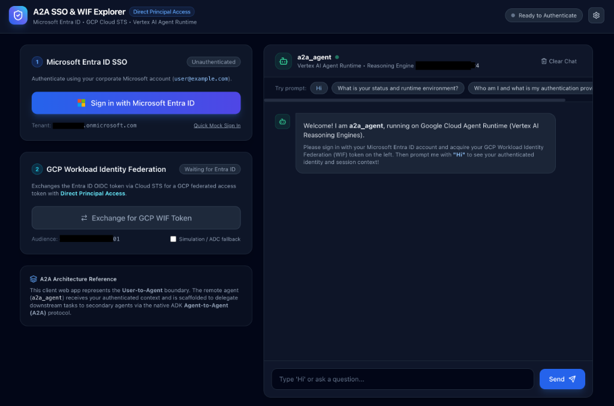
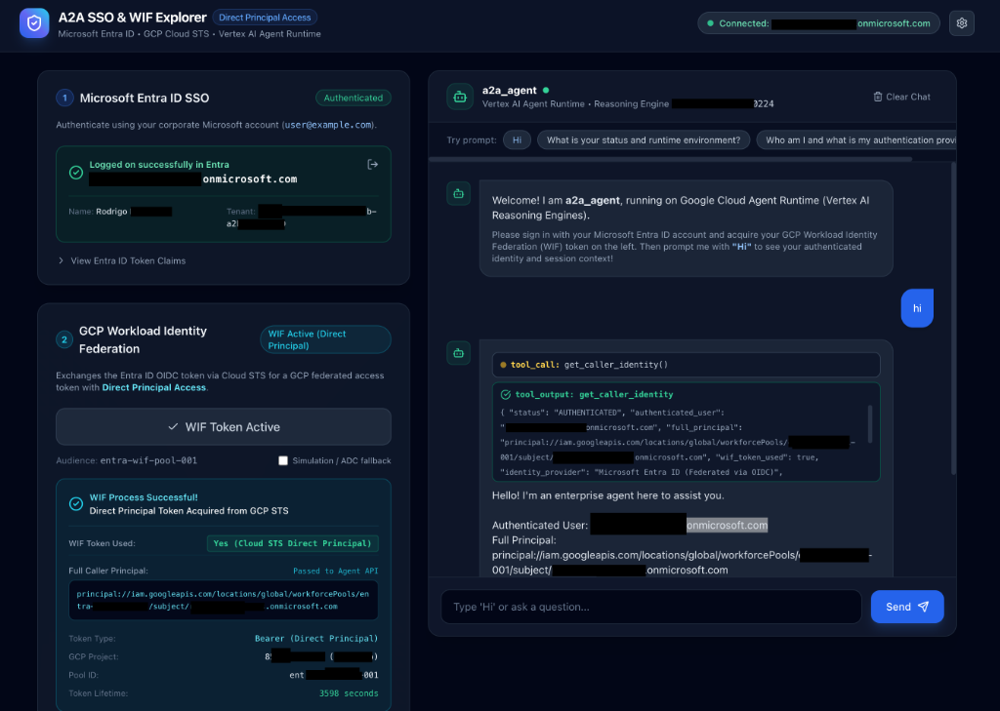
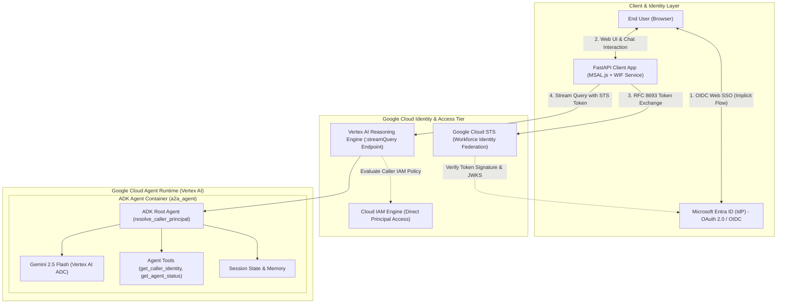
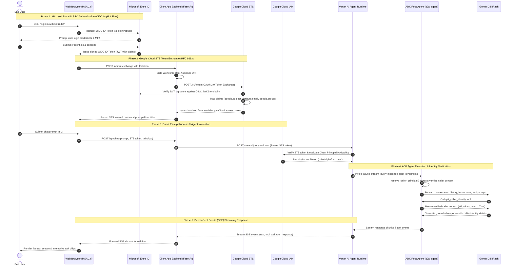

# Agent-to-Agent SSO & WIF Explorer (`a2a-sso`)

This repository provides an end-to-end reference web application answering the question: **"How do I authenticate my end user with the Google Agent Development Kit (ADK) running in Google Cloud Agent Runtime (Vertex AI Reasoning Engines) if my Identity Provider (IdP) is Microsoft Entra ID?"**

It demonstrates how a browser-based client application authenticates users via Microsoft Entra ID SSO (OIDC Implicit Flow), exchanges the Entra ID token with Google Cloud Security Token Service (STS) for a federated access token using Workforce Identity Federation (WIF) with Direct Principal Access, and directly queries the deployed ADK agent—enforcing granular IAM permissions without managing long-lived service account keys.

## 🖥️ Web Application Interface

| Initial State (Ready to Authenticate) | Authenticated Session & Direct Principal WIF |
| :---: | :---: |
| [](docs/images/app_before_auth.png) | [](docs/images/app_after_auth.png) |

> [!WARNING]
> **Example Code Notice — Not Suitable for Production Without Adjustments**  
> This repository contains reference and demonstration code intended to illustrate architectural concepts (Google Cloud Agent Runtime, A2A protocol, and Microsoft Entra ID SSO via Workload/Workforce Identity Federation). **This code is not suitable for production use as-is.** Critical adjustments are required before deploying to production environments, including, but not limited to:
> - **Restricting CORS**: Replacing wildcard (`*`) origins with explicit, trusted domains.
> - **Server-Side Token Verification**: Validating Entra ID JWT signatures and claims against Microsoft JWKS endpoints before token exchange.
> - **Removing Development Bypasses**: Disabling mock sign-in and local ADC token simulation endpoints.
> - **Enforcing HTTPS & Secrets Management**: Requiring end-to-end TLS/HTTPS and loading configuration from Google Cloud Secret Manager instead of `.env` files.
> - **API Hardening**: Implementing rate limiting, request throttling, and sanitized error responses.
>
> For full guidance on transitioning to production, see [Production & Security Considerations](#-production--security-considerations).

---

## 🏗️ Architecture & Component Topology



---

## 🔄 End-to-End SSO & WIF Step-by-Step Flow

The following diagram illustrates every single step of the authentication, token exchange, authorization, and agent execution flow across all system boundaries:



### 📋 Detailed Step-by-Step Execution Breakdown

| Step | Phase | Component / Actor | Action & Technical Description |
| :---: | :--- | :--- | :--- |
| **1** | **Phase 1: Entra ID SSO** | **End User** | User opens the web client interface (`http://localhost:8000`) and clicks **Sign in with Entra ID**. |
| **2** | **Phase 1: Entra ID SSO** | **Web Browser (`app.js`)** | The MSAL.js client triggers `msalInstance.loginPopup()` requesting OIDC scopes (`openid`, `profile`, `email`) and implicit ID token grant. |
| **3** | **Phase 1: Entra ID SSO** | **Microsoft Entra ID** | Entra ID renders the Microsoft login modal, prompting the user for corporate credentials, MFA verification, and tenant consent. |
| **4** | **Phase 1: Entra ID SSO** | **End User** | User successfully authenticates and approves required application scopes. |
| **5** | **Phase 1: Entra ID SSO** | **Microsoft Entra ID** | Entra ID issues a signed OpenID Connect ID Token (`id_token` RS256 JWT) containing identity claims (`sub`, `oid`, `email`, `preferred_username`, `name`, `groups`). |
| **6** | **Phase 2: STS Token Exchange** | **Web Browser (`app.js`)** | The client automatically posts the raw Entra ID token to the backend endpoint `POST /api/wif/exchange` (`client_app/main.py`). |
| **7** | **Phase 2: STS Token Exchange** | **Client Backend (`wif_service.py`)** | Constructs the Google Cloud Workforce Identity Pool audience URI: `//iam.googleapis.com/locations/global/workforcePools/<POOL_ID>/providers/<PROVIDER_ID>`. |
| **8** | **Phase 2: STS Token Exchange** | **Client Backend (`wif_service.py`)** | Executes an RFC 8693 OAuth 2.0 Token Exchange request against `https://sts.googleapis.com/v1/token` with `grant_type=urn:ietf:params:oauth:grant-type:token-exchange`, `subject_token_type=urn:ietf:params:oauth:token-type:jwt`, and `requested_token_type=urn:ietf:params:oauth:token-type:access_token`. |
| **9** | **Phase 2: STS Token Exchange** | **Google Cloud STS** | STS contacts Microsoft Entra ID's OIDC discovery JWKS endpoint (`https://login.microsoftonline.com/{tenant}/discovery/v2.0/keys`) to cryptographically verify token signature, issuer, audience, and expiration. |
| **10** | **Phase 2: STS Token Exchange** | **Google Cloud STS** | Evaluates Workforce Pool attribute mappings: `google.subject=assertion.sub`, `attribute.email=assertion.email \|\| assertion.preferred_username`, `google.display_name=assertion.name`, and `google.groups=assertion.groups`. |
| **11** | **Phase 2: STS Token Exchange** | **Google Cloud STS** | STS mints and returns a short-lived federated Google Cloud access token representing the federated identity (**Direct Principal Access** — no service account keys). |
| **12** | **Phase 2: STS Token Exchange** | **Client Backend (`wif_service.py`)** | Returns the STS token, expiry lifetime, and canonical IAM principal string (`principalSet://iam.googleapis.com/locations/global/workforcePools/<POOL>/attribute.email/<EMAIL>`) to the browser UI. |
| **13** | **Phase 3: Direct Principal Access** | **End User** | User types a query into the chat input (e.g. *"Hello! Who am I and what is your status?"*) and hits send. |
| **14** | **Phase 3: Direct Principal Access** | **Web Browser (`app.js`)** | Sends `POST /api/chat` with message payload, session ID, caller principal identifier, and the active Google Cloud STS federated token. |
| **15** | **Phase 3: Direct Principal Access** | **Client Backend (`agent_engine_client.py`)** | Dispatches an HTTP POST request to Vertex AI Agent Runtime: `https://{location}-aiplatform.googleapis.com/v1beta1/{resource_name}:streamQuery` with `Authorization: Bearer <GCP_STS_TOKEN>` and body `{"classMethod": "async_stream_query", "input": {"user_id": "<principal>", "message": "...", "session_id": "..."}}`. |
| **16** | **Phase 3: Direct Principal Access** | **Vertex AI Agent Runtime** | Intercepts the request and queries Cloud IAM to evaluate permissions for the federated principal. |
| **17** | **Phase 3: Direct Principal Access** | **Google Cloud IAM** | Validates that the federated principal (`principalSet://.../attribute.email/<EMAIL>`) holds the `roles/aiplatform.user` IAM role bound to the Reasoning Engine resource or project level (configured via `grant_wif_engine_access.py`). Access is authorized. |
| **18** | **Phase 4: ADK Agent Execution** | **Vertex AI Agent Runtime** | Invokes the containerized ADK Root Agent (`a2a_agent/agent.py`), passing the input payload, message, and caller `user_id`. |
| **19** | **Phase 4: ADK Agent Execution** | **ADK Root Agent (`agent.py`)** | Executes `resolve_caller_principal(tool_context)` on the invocation `ToolContext`, extracting the verified workforce pool identity and setting `wif_token_used: true`. |
| **20** | **Phase 4: ADK Agent Execution** | **ADK Root Agent (`agent.py`)** | Forwards the prompt, system instructions, and conversation state to the Gemini 2.5 Flash model. |
| **21** | **Phase 4: ADK Agent Execution** | **Gemini 2.5 Flash** | Model detects user greeting / inquiry and triggers tool execution: `get_caller_identity` and `get_agent_status`. |
| **22** | **Phase 4: ADK Agent Execution** | **ADK Tools (`agent.py`)** | Executes tools in the agent container, returning verified caller identity details (email, full principal URI, WIF status, region, session ID). |
| **23** | **Phase 4: ADK Agent Execution** | **Gemini 2.5 Flash** | Synthesizes a grounded, verifiable response strictly based on the tool's verified identity context. |
| **24** | **Phase 5: Streaming Response** | **ADK Root Agent (`agent.py`)** | Streams text chunks, function call events, and function response events back to Agent Runtime. |
| **25** | **Phase 5: Streaming Response** | **Vertex AI Agent Runtime** | Streams Server-Sent Events (SSE) back across the open HTTP connection to the client backend. |
| **26** | **Phase 5: Streaming Response** | **Client Backend (`agent_engine_client.py`)** | FastAPI relays the SSE data stream chunk-by-chunk to the client browser. |
| **27** | **Phase 5: Streaming Response** | **Web Browser (`app.js`)** | The browser UI dynamically renders the typing assistant message, collapsible tool execution chips (`get_caller_identity`), and verified authentication metadata. |

---

## 📂 Repository Layout

```text
a2a-sso/
├── .env                               # Active local environment variables (never committed)
├── .env.example                       # Checked-in template with documentation & placeholder values
├── .gitignore                         # Comprehensive agent & secrets exclusion rules
├── deploy_agent.sh                    # Deployment / in-place update to Vertex AI Agent Runtime
├── get_agent_id.py                    # Resolves deployed Reasoning Engine ID via Vertex AI SDK
├── verify_agent_api.py                # Programmatic multi-turn API test harness
├── read_cloud_logs.py                 # Live Cloud Logging stream for troubleshooting
├── grant_wif_engine_access.py         # Assigns IAM roles to federated WIF principals
├── grant_wif_engine_access.sh         # Shell helper for WIF principal IAM binding
├── run_client.py                      # Starts the local SSO & WIF test web application
├── client_app/                        # FastAPI client & MSAL frontend application
│   ├── main.py                        # Backend API & static server
│   ├── wif_service.py                 # GCP STS token exchange & Direct Principal Access
│   ├── agent_engine_client.py         # Vertex AI Reasoning Engine REST caller
│   └── static/                        # Browser UI with MSAL.js, Tailwind & Lucide icons
├── a2a_agent/                         # Agent module
│   ├── .env                           # Agent environment variables (never committed)
│   ├── __init__.py
│   ├── agent.py                       # ADK root_agent definition, tools & instructions
│   └── requirements.txt               # Agent Python package dependencies
└── README.md                          # Project documentation
```

---

## 🚀 Quick Start

### 1. Prerequisites
- Python 3.12+
- [`uv`](https://docs.astral.sh/uv/) for fast package and virtual environment management
- Google Cloud CLI (`gcloud`)

### 2. Environment Setup
```bash
# Create and activate virtual environment
uv venv .venv
source .venv/bin/activate

# Install dependencies
uv pip install -r a2a_agent/requirements.txt
```

### 3. Google Cloud Authentication & Configuration
Configure Application Default Credentials (ADC) for Vertex AI:
```bash
# Authenticate gcloud & set ADC
gcloud auth login --update-adc
gcloud auth application-default set-quota-project your-project-id

# Configure .env
cp .env.example .env
# Edit .env and set your GOOGLE_CLOUD_PROJECT
```

---

## 🧪 Local Testing & Development

### ADK Web UI
Launch the interactive web console:
```bash
.venv/bin/adk web a2a_agent
```

### ADK CLI
Run multi-turn conversational tests from the terminal:
```bash
.venv/bin/adk run a2a_agent
```

---

## ☁️ Deployment & Cloud Verification

### 1. Deploy to Vertex AI Agent Runtime
Deploy a new instance or perform an in-place update to an existing Reasoning Engine:
```bash
./deploy_agent.sh a2a_agent
```

### 2. Multi-Turn API Verification
Run automated test assertions against the live deployed endpoint (`:streamQuery`):
```bash
./verify_agent_api.py a2a_agent
```

### 3. Live Cloud Logs
Stream logs from Cloud Logging for the deployed Reasoning Engine:
```bash
./read_cloud_logs.py a2a_agent 25
```

---

## 🔐 Workforce Identity Federation (WIF) & Microsoft Entra ID Setup

This project demonstrates end-to-end Single Sign-On (SSO) and direct principal access where Microsoft Entra ID (formerly Azure AD) users authenticate in a web client, exchange their Entra ID token for a Google Cloud Security Token Service (STS) federated access token, and query the deployed Vertex AI Reasoning Engine directly without service account key management.

> [!TIP]
> **Visual Walkthrough Available**: For a visual diagram illustrating every single interaction step between Entra ID, MSAL.js, Cloud STS, Cloud IAM, Vertex AI Agent Runtime, and the ADK Agent, see the [End-to-End SSO & WIF Step-by-Step Flow](#-end-to-end-sso--wif-step-by-step-flow).

### 📚 Source & Reference Documentation
- Official Google Cloud Documentation: [Configure Workforce Identity Federation with Microsoft Entra ID and sign in users](https://docs.cloud.google.com/iam/docs/workforce-sign-in-microsoft-entra-id?utm_source=gemini)
- Microsoft Entra ID Documentation: [Enable ID token implicit grant in Microsoft Entra ID](https://learn.microsoft.com/en-us/entra/identity-platform/v2-oauth2-implicit-grant-flow)

---

### 🧠 Architectural Decisions: OIDC vs. SAML 2.0 & Implicit Flow

#### 1. Why OpenID Connect (OIDC) instead of SAML 2.0?
While Google Cloud Workforce Identity Federation supports both OIDC and SAML 2.0, this architecture intentionally leverages **OIDC**:
- **Lightweight JSON Web Tokens (JWT) vs. Heavy XML**: OIDC uses compact, standardized JSON Web Tokens (RFC 7519) signed via asymmetric cryptography (RS256). In contrast, SAML 2.0 uses large, verbose XML documents with XML Digital Signatures (XML-DSig) that require complex XML parsing libraries and certificate handling.
- **Native Single-Page App (SPA) Support**: The client frontend uses the official Microsoft Authentication Library (`@azure/msal-browser`), which is natively built on OAuth 2.0 / OIDC standards for browser environments.
- **Direct REST Token Exchange via Google Cloud STS**: Google Cloud's Security Token Service (`sts.googleapis.com` / `token.googleapis.com`) natively supports the OAuth 2.0 Token Exchange specification (RFC 8693) with `urn:ietf:params:oauth:token-type:id_token`. An OIDC ID token is passed directly in an HTTP POST request to obtain a short-lived Google Cloud STS access token, without needing SAML assertion consumer service (ACS) redirects or server-side SAML translation layers.
- **Seamless Attribute Mapping**: Claims in OIDC JWTs (such as `oid`, `sub`, `email`, `preferred_username`, `groups`) are directly addressable in Google Cloud attribute mappings (`assertion.<claim_name>`).

#### 2. Why Implicit Flow (`id-token`)?
In OIDC web sign-in and direct client token exchange, **Implicit Flow** is utilized for identity token acquisition:
- **Direct Browser ID Token Acquisition**: Implicit flow allows the browser/SPA client to receive a signed `id_token` directly from Microsoft Entra ID without exchanging an authorization code using a backend client secret (`client_secret`).
- **Zero Secrets on Public Clients**: Public clients (browser applications) cannot securely store secrets. Standard Authorization Code flow without PKCE requires a `client_secret`, which is insecure on frontends. Even when PKCE is used for API access tokens, Google Cloud Workforce Identity Federation for web sign-in and STS direct identity exchange specifically expects an **ID Token** containing user identity assertions (`sub`, `email`, etc.).
- **Aligned with Google Cloud WIF Provider Spec**: Google Cloud Workforce Identity Pool OIDC providers configured for web SSO require:
  - `--web-sso-response-type="id-token"`
  - `--web-sso-assertion-claims-behavior="only-id-token-claims"`
  This exactly matches Microsoft Entra ID's **ID token implicit grant** mode.

---

### 🛠️ Step-by-Step Setup Guide

#### Step 1: Register and Configure the Application in Microsoft Entra ID
1. Sign in to the [Microsoft Entra admin center](https://entra.microsoft.com/).
2. Navigate to **Identity** > **Applications** > **App registrations** > **New registration**.
   - **Name**: `a2a-sso-agent` (or your preferred application name).
   - **Supported account types**: Select *Accounts in this organizational directory only (Single tenant)* or *Multitenant* based on your organization.
   - **Redirect URI**: Select **Single-page application (SPA)** (or **Web**) and enter:
     ```text
     http://localhost:8000
     ```
   - Click **Register**.
3. **Enable ID Token Implicit Grant (Crucial Step)**:
   - In your newly registered app, go to **Manage** > **Authentication**.
   - Scroll down to the **Implicit grant and hybrid flows** section.
   - Check the **ID tokens (used for implicit and hybrid flows)** checkbox.
   - Click **Save**.
4. **Configure Token Claims**:
   - Go to **Manage** > **Token configuration**.
   - Click **Add optional claim**, choose **ID**, and select `email`, `preferred_username`, and `upn`.
   - If using group-based access control, click **Add groups claim** and select **Security groups**.
5. **Collect Configuration Values**:
   - Go to **Overview** and copy:
     - **Application (client) ID** &rarr; `ENTRA_CLIENT_ID`
     - **Directory (tenant) ID** &rarr; `ENTRA_TENANT_ID`

---

#### Step 2: Configure Google Cloud Workforce Identity Federation (WIF)

> [!NOTE]
> Workforce Identity Pools are created at the **Organization** level (unlike Workload Identity Pools which belong to a project). Ensure you have the `roles/iam.workforcePoolAdmin` IAM role on your Google Cloud Organization.

##### 1. Create the Workforce Identity Pool
```bash
gcloud iam workforce-pools create YOUR_POOL_ID \
    --organization="YOUR_ORGANIZATION_ID" \
    --location="global" \
    --display-name="Entra ID Workforce Pool" \
    --description="Workforce pool for Microsoft Entra ID federated users"
```

##### 2. Create the OIDC Provider (Configured for Implicit Flow)
Create the OIDC provider linked to your Microsoft Entra tenant, configuring implicit flow (`id-token` response type) and attribute mappings:

```bash
gcloud iam workforce-pools providers create-oidc YOUR_PROVIDER_ID \
    --workforce-pool="YOUR_POOL_ID" \
    --location="global" \
    --display-name="Microsoft Entra ID" \
    --description="OIDC Provider using Entra ID Implicit Flow ID tokens" \
    --issuer-uri="https://login.microsoftonline.com/YOUR_TENANT_ID/v2.0" \
    --client-id="YOUR_ENTRA_CLIENT_ID" \
    --web-sso-response-type="id-token" \
    --web-sso-assertion-claims-behavior="only-id-token-claims" \
    --attribute-mapping="google.subject=assertion.sub,attribute.email=assertion.email || assertion.preferred_username,google.display_name=assertion.name || assertion.preferred_username,google.groups=assertion.groups" \
    --detailed-audit-logging
```

##### Attribute Mapping Breakdown:
| Google Cloud Attribute | Entra ID Assertion Claim | Purpose |
| :--- | :--- | :--- |
| `google.subject` | `assertion.sub` (or `assertion.oid`) | Unique, immutable identifier of the user in Google Cloud. |
| `attribute.email` | `assertion.email \|\| assertion.preferred_username` | Normalized user email, used to grant principal-level access. |
| `google.display_name` | `assertion.name \|\| assertion.preferred_username` | Human-friendly name displayed in Cloud Logging & audit traces. |
| `google.groups` | `assertion.groups` | List of group Object IDs the user belongs to (for group-based IAM). |

---

#### Step 3: Configure Environment Variables

Update your local `.env` file with your Entra ID and GCP WIF identifiers:

```bash
# --- Microsoft Entra ID (Azure AD) SSO Configuration ---
ENTRA_CLIENT_ID="00000000-0000-0000-0000-000000000000"
ENTRA_TENANT_ID="your-tenant-id.onmicrosoft.com"
ENTRA_REDIRECT_URI="http://localhost:8000"

# --- Google Cloud Workforce Identity Federation (WIF) Configuration ---
GCP_WIF_POOL_ID="your-workforce-pool-id"
GCP_WIF_PROVIDER_ID="your-oidc-provider-id"
IS_WORKFORCE_POOL="true"

# --- Google Cloud Target Deployment ---
GOOGLE_CLOUD_PROJECT="your-project-id"
PROJECT_NUMBER="123456789012"
GOOGLE_CLOUD_LOCATION="us-central1"
REASONING_ENGINE_ID="123456789012345678"
```

---

#### Step 4: Grant Vertex AI Reasoning Engine IAM Permissions

When federated callers query the Reasoning Engine directly with their exchanged Google Cloud STS token, GCP verifies their identity using **Direct Principal Access**. Grant `roles/aiplatform.user` to the federated principal using their email attribute:

```bash
# Grant access to user by email attribute (Reasoning Engine resource & Project)
./grant_wif_engine_access.sh --email user@example.com

# List current IAM policies on the Reasoning Engine and Project
./grant_wif_engine_access.sh --list

# Or specify custom scope ('engine', 'project', or 'both')
./grant_wif_engine_access.sh --scope engine --email user@example.com
```

The script automatically:
1. Verifies that the Workforce Identity Provider maps `attribute.email`.
2. Formats the canonical IAM principal identifier:
   ```text
   principalSet://iam.googleapis.com/locations/global/workforcePools/<POOL_ID>/attribute.email/<EMAIL>
   ```
3. Sets the IAM policy binding on the Vertex AI Reasoning Engine resource (`:setIamPolicy`) and the GCP project.

---

#### Step 5: Run the Web Client & Test the SSO / WIF Flow

Launch the local client web application:
```bash
uv run run_client.py
```
Open your browser at `http://localhost:8000`:
1. **Entra ID Login**: Click **Sign in with Entra ID**. The MSAL popup authenticates against your Entra tenant and retrieves an OIDC ID token via implicit grant.
2. **GCP STS Token Exchange**: Click **Exchange for GCP STS Token**. The client calls the Google Cloud Security Token Service (`v1/token`) with the Entra ID token to receive a short-lived federated access token.
3. **Query Agent Engine**: Send a message in the chat interface. The client issues a streaming query (`:streamQuery`) to the Vertex AI Reasoning Engine endpoint authenticated solely by the federated STS token.

---

## 🛡️ Production & Security Considerations

This repository contains **example code only and is not suitable for production use as-is**. Adjustments are needed for this code to be production-grade, including:

### 1. CORS Policy Hardening
In [`client_app/main.py`](client_app/main.py), CORS is configured with `allow_origins=["*"]`:
- **Local Development & Demo**: Permissive wildcard origins allow quick local testing on `http://localhost:8000`.
- **Production Deployment**: Restrict allowed origins strictly to your trusted frontend domain(s):
  ```python
  app.add_middleware(
      CORSMiddleware,
      allow_origins=["https://your-domain.example.com"],
      allow_credentials=True,
      allow_methods=["GET", "POST", "OPTIONS"],
      allow_headers=["*"],
  )
  ```

### 2. Cryptographic JWT Verification
In [`client_app/wif_service.py`](client_app/wif_service.py), the client decodes the Entra ID token payload directly for claim extraction, relying entirely on Google Cloud STS to validate token authenticity.
- **Production Adjustment**: Perform server-side JWT signature, audience (`aud`), and issuer (`iss`) verification against Microsoft Entra ID's OpenID Connect discovery JWKS endpoint (`https://login.microsoftonline.com/{tenant}/discovery/v2.0/keys`) before initiating STS exchange.

### 3. Removal of Development Fallbacks & Mock Auth
The application contains developer-convenience features designed for testing before cloud infrastructure is fully provisioned:
- **Quick Mock Sign In**: Generates synthetic Entra tokens for UI testing.
- **ADC Simulation Mode**: Falls back to local Application Default Credentials when STS exchange is bypassed.
- **Production Adjustment**: Remove or strictly gate these fallback paths behind environment flags (e.g. `ENVIRONMENT=production`) to prevent unauthenticated access.

### 4. Transport Security (HTTPS/TLS)
- **Production Adjustment**: Enforce end-to-end HTTPS/TLS with HTTP Strict Transport Security (HSTS). Never transmit OIDC ID tokens or Google Cloud STS federated tokens over plaintext HTTP.

### 5. Secrets & Configuration Management
- **Production Adjustment**: Replace local `.env` files with a centralized secrets manager such as **Google Cloud Secret Manager** or **Azure Key Vault**, utilizing IAM-governed access controls for runtime credential loading.

### 6. Rate Limiting, Session Management & Sanitized Errors
- **Rate Limiting**: Protect backend endpoints (`/api/chat`, `/api/wif/exchange`) with rate limiters (e.g., slowapi or Cloud Armor) to prevent abuse and denial-of-service.
- **Error Sanitization**: Avoid returning raw upstream API error messages or stack traces to clients in production.
- **Session Stores**: Store session state and conversation memory in persistent, scalable backing stores (such as Cloud Memorystore / Redis or Firestore) rather than in-memory structures.

---

## 📄 License

This project is licensed under the Apache License, Version 2.0 - see the [LICENSE](LICENSE) file for details.


